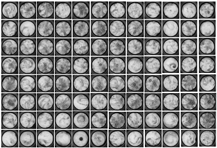
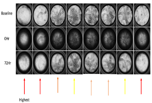
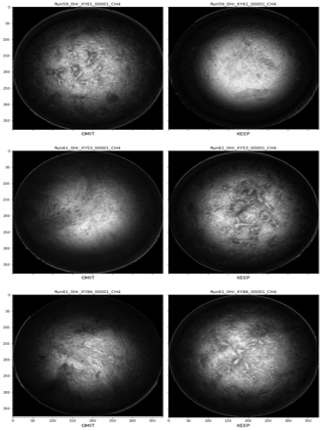
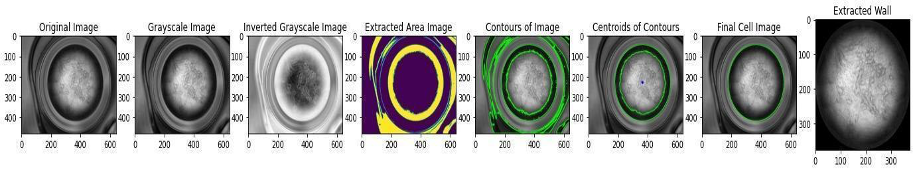
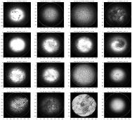
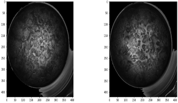

# USD MADS Capstone Project - Team 14
## Predicting Cell Culture Viability using a Sequential Hybrid Model

# Table of Contents

--------

- [Authors and Collaborators](#authors-and-collaborators)
- [Installation](#installation)
- [Technologies](#technologies)
- [About the Project](#about-the-project)
  * [Problem Statement](#problem-statement)
  * [Justification](#justification)
- [Data Exploration](#data-exploration)
  * [Original Data](#original-data)
   - [Data Set Files](#data-set-files)
 - [Data Preparation](#data-preparation)
- [Model Training](#Model-training)
- [Model Strategies](#model-strategies)
- [Presentations and Reports](#presentations-and-reports)
- [Code](#code)
- [Conclusion](#conclusion)
- [References](#references)

-------

# Authors and Collaborators
- Hanmaro Song
- Emanuel Lucban

# Installation
To clone this repository onto your device, use the commands below:

	1. git init
	2. git clone git@github.com:https://github.com/hsong1101/HTS_Imaging_Project

## Technologies

- Python
  - Pre-Trained RESNET50 from torchvision PyTorch library
  - Scikit Learn
  - imblearn
- Jupyter Lab
- AWS S3

# About the Project

For our research use-case, the women’s reproductive health study led by Dr. Leo Han at The Oregon Health and Sciences University (OHSU) is conducting a study to develop a hormoneless contraceptives protocol. 
The study uses harvested endometrial cells from several primates and cultured in small vessels known as wells. For each test run, a group of wells is given a precisely controlled number of endometrial cells. 
Certain wells are then treated with different drugs and doses, recorded using photography at fixed intervals of 0 hours, 12 hours, 24 hours, 48 hours, 72 hours, and 96 hours in the following chart. 

Mucus formation along the exterior wall is formed, known as the meniscus. The amount of meniscus produced is directly correlated with a woman’s receptiveness to pregnancy. The correct combination of drugs and doses that affect meniscus production can potentially be used as an effective contraceptive protocol, without the side effects associated with hormone-based contraceptive methods.

## Problem Statement

A significant issue was discovered in the course of the OHSU research study. In almost every run, large variability in results occurs at the 96-hour interval. 
Wells that have been treated exactly the same, (same number of cells, treatment and time) can produce dramatically different results as shown in the following picture.

The well with abnormal results must then be discarded, potentially wasting 96 hours of an experiment run.
Our motivation is to conduct a project that involves solving a highly complex problem utilizing computer vision. 
Our hope for this project is to leverage deep convolutional models to streamline the process of identifying viable wells and predict whether a well should be rejected early in a run. 
This will not only save time for the research study but will also potentially remove human error associated with manual checking of wells that are out of range. 

As an example in the next chart, we can see that there is no visible or clear distinction between those cells marked as **OMIT** and **KEEP**.

When researchers were conducting experiments, they didn't put much focus on the structures of cells but rather the combinations of drugs as they are the main sources affecting the outcome.
However, after seeing many occasions where same amount of drugs with the same combinations gave different outputs, they suspected that maybe the structure of each cell affects the results as well which we are trying to explore in this project.

# Data Exploration

## Original Data 

High Throughput Screen (HTS) Culture Surface Hydration Image dataset

## Data Set Files

The Dataset is part of ongoing research at Oregon Health and Sciences University and is not publicly available.

# Data Preparation

The HTS Imaging Dataset from the OHSU research study consists of 80 experimental runs, each composed of 96 images of cell culture wells at the experiment’s 0 hour. 
However, we noticed that not all runs have corresponding 0 hr cell images. Some runs skipped capturing those 0 hr images which later runs included after the protocol had changed.
Associated tabular data containing the run’s results such as meniscus widths, drug types and amounts, cell culture well position and a binary OMIT column as the resulting viability of the cell culture well after the entire 96 hour run.

The image preprocessing pipeline involves the extraction of the raw, 0 hour well images and converted into single channel grayscale images. 
OpenCV, an open source, computer vision python library is then used to perform pixel clustering to generate contours for the region of interest for each image. 
Using various thresholds, we were able to create consistent masking of the cell culture well interiors, generating 448 x 448 png images.

Among around 5,000 images, 3,892 cell images were extracted without any issues.

Still, among those that have been successfully extracted, we had to make sure that those images were usable, meaning not too dark or too bright.
Using +/- two stadard deviations from the mean, we looked for any outliers and next are the examples.

It's easy to see that there are some disturbances outside the well. Using this logic, we excluded any outliers there are. 
There may be a better approach to address this problem. However, given the tight schedule, we had to choose this method.

After the extraction, to compensate the lack of training data, we augmented by randomly flipping or rotation the images. 

# Model Training

Due to the limited amount of training image data and limited computational resources, the modeling
approach is in two parts. First, a pretrained CNN model to be used as a feature extractor, excluding output 
from the fully connected, classification layers. Second, a traditional ML classifier to be trained using the
embeddings from the CNN model as features. These two models will be running in sequence, hence, sequential hybrid 
model.

**CNN Model**
The chosen pretrained CNN model is the RESNET50 convolutional neural network. The RESNET50 is provided by
PyTorch's torchvision library and is trained on the IMAGENET1K_V2 image dataset used for object detection.
The model consists of 48 convolutional layers, 1 maxpool layer and 1 average pool layer. Embeddings will be 
extracted from the last convolutional layer, resulting in 2,048 length vector embeddings to be used as input
for the traditional ML classifier.

**Classification Models**
The classification models that were trained and tuned are:

Linear Classifiers   
- Logistic Regression
- Support Vector Machines

Generative Models
- Linear Discriminant Analysis
- Quadratic Discriminant Analysis
- Naive Bayes

Trees and Ensemble Models
- Decision Trees
- Random Forests
- XGBoost

# Model Training Strategies 

All models were trained using 5-fold cross validation and models with hyper-parameters were
tuned using a grid search pattern with tunings selected based on highest accuracy on training and test data.

Evaluation of candidate models will be using both accuracy and f1-score since both false positives and false negatives
are considered equally detrimental. Performance will also be evaluated against an "all positive" baseline model. Since there
is a large class imbalance between the negative (0) and positive (1) classes, 9% and 91% respectively, the baseline model
will have a 91% overall accuracy.

# Conclusion

Based on overall accuracy and individual class F1 scores, the selection was very narrow between
the tuned Random Forest model and tuned Support Vector Machines. Although, the Support Vector Machines was
able to slightly better predict 5-Star ratings, we opted for the Random Forest Model which had
a overall higher accuracy of 39% since 5 Star movies are very rare and Random Forest was able
to better predict overall.  

# Next Steps  
  
We would like to further refine this project as time allows by:
- Introduce continuous data collection for future experiment runs to increase dataset size
- Introduce non-linear dimensionality reduction for better generalization
  - UMAP
- Test more CNN models as feature extractors
  - Other RESNET variants
  - UNET
  - YOLO
  - VGG
- Introduce interpretability on the CNN model to find the most salient visual features

# Code
https://github.com/hsong1101/HTS_Imaging_Project

